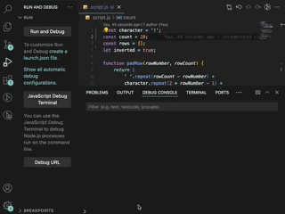

# PYRAMID GENERATOR APP

The Pyramid Generator application was built as a practice project for a JavaScript Algorithms and Data Structures course with FreeCodeCamp. This app allows users to generate a pyramid in the console, specifying the characters, number of rows, and the pyramid's orientation (pointing up or down). Developed using HTML, CSS, and JavaScript, the app utilizes arrays, strings, functions, loops, and if/else statements.

## Features

- Customizable Pyramid Generation: The Pyramid Generator app allows users to create pyramids in the console by customizing the character, number of rows (count), and the pyramid's orientation (inverted). These variables can be easily modified to design a pyramid according to the user's preferences.

## Technologies

- HTML
- CSS
- JavaScript

## Start the App

In the project directory, Open up your terminal.

Open Debug Console tab. Run and Debug to show the Resulting Pyramid. Changes values of character, count(number) and inverted(true or false) and run DEBUG session to see results.

### Author

[Tanimara Elias Santos](https://github.com/tanimaraeliassantos)

### Version

1.0.0
